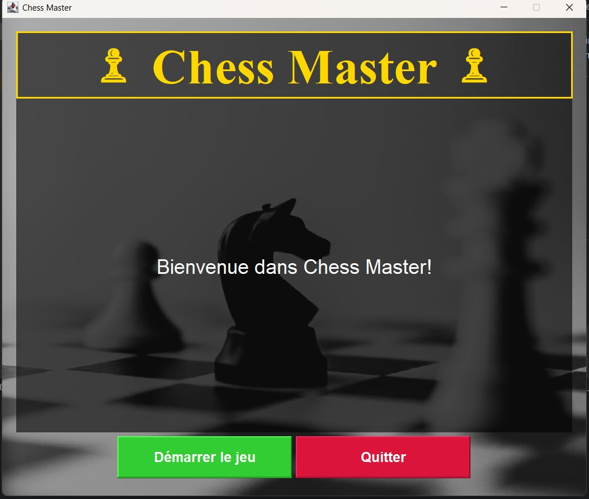
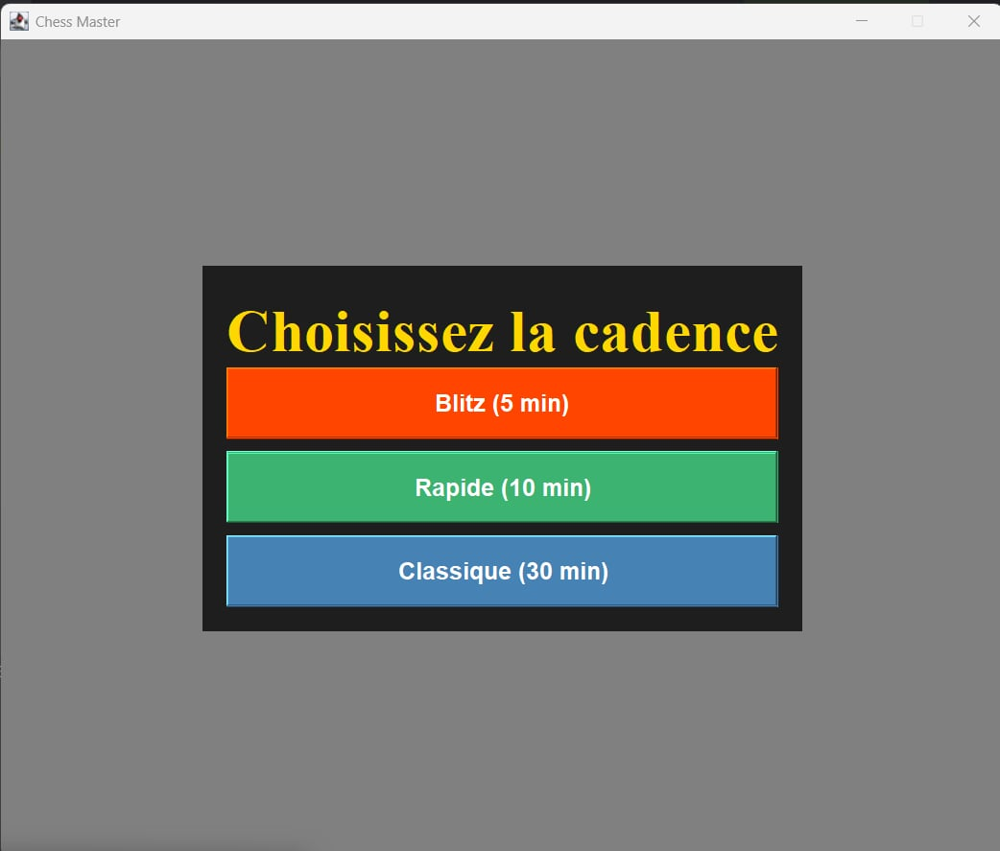
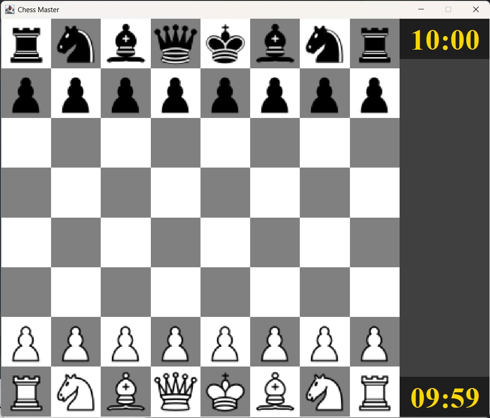
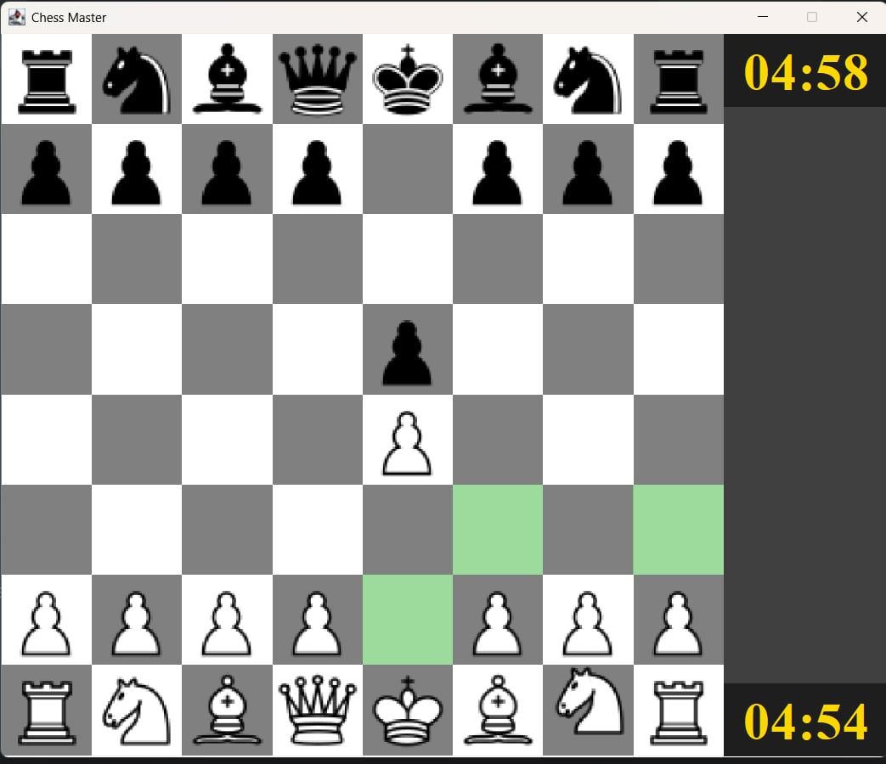
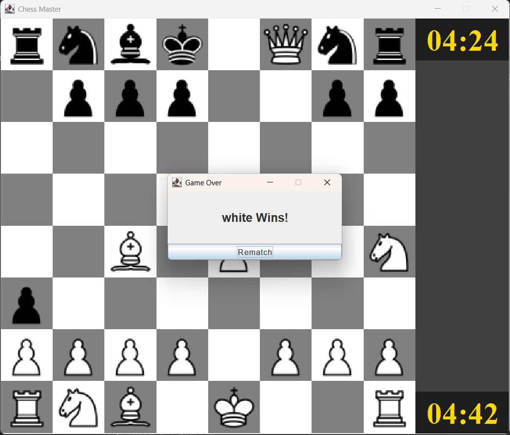

# ChessGame

Object-oriented Java chess game implementing core chess rules.

This project was developed to strengthen skills in software architecture, game logic, and clean separation of concerns using a Model / Controller / App structure.

---

## Key Features

- Legal move validation for all chess pieces
- Turn-based gameplay system
- Check detection logic
- Object-oriented implementation per piece
- Board and move abstraction

---

## Technologies

- Java
- Maven

---

## Architecture Overview

src/
├── App         – Application entry point  
├── Controller – Game flow and user input handling  
└── Model       – Board, pieces, moves, and rules logic

---

## Screenshots

<b>Home screen – game entry menu</b>

  

<b>Time control selection (Blitz / Rapid / Classic)</b>

  

<b>Initial board setup</b>

  

<b>Move highlighting and interaction</b>

  

<b>Game over screen – victory detection</b>

  

---

## Getting Started

1. Clone the repository:

git clone https://github.com/YOUR_USERNAME/ChessGame.git

2. Open the project using IntelliJ IDEA or Eclipse.

3. Run `Main.java`.

---

## Author

Tanjon’Yavo
